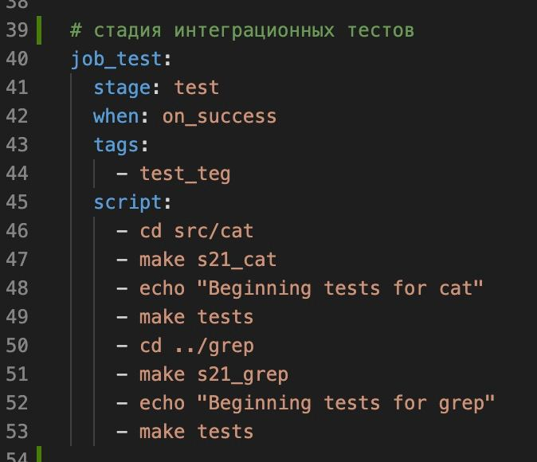
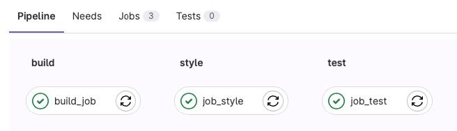

## Part 1. Настройка gitlab-runner

+ Подними виртуальную машину Ubuntu Server 22.04 LTS.
+ Скачай и установи на виртуальную машину gitlab-runner.
+ Запусти gitlab-runner и зарегистрируй его для использования в текущем проекте (DO6_CICD).

На виртуальной машине `ws1` закачиваем gitlab-runner с помощью команды `sudo apt-install gitlab-runner`

\
*Установка gitlab-runner*

Вводим длинную команду:
```
curl -L "https://packages.gitlab.com/install/repositories/runner/gitlab-runner/script.deb.sh" | sudo bash
```
Которая выполняет следующее:
+ Использует curl для загрузки содержимого файла `script.deb.sh` с URL `https://packages.gitlab.com/install/repositories/runner/gitlab-runner/script.deb.sh`
+ Применяет флаг `-L` для следования HTTP-редиректам, если таковые имеются. Это означает, что если сервер, на который осуществляется запрос, возвращает редирект (например, из-за перемещения ресурса), curl автоматически перейдет по новому адресу, указанному в редиректе, и попытается загрузить ресурс оттуда. Без флага `-L` curl просто вернет код состояния редиректа и URL, на который нужно перейти, не пытаясь загрузить ресурс с нового URL.
+ Перенаправляет вывод `curl` в стандартный ввод (stdin) команды `sudo bash`.
+ Команда `sudo bash` запускает оболочку Bash с правами суперпользователя (sudo), что позволяет выполнять команды с повышенными привилегиями.
+ Содержимое файла `script.deb.sh`, которое было загружено с помощью curl, выполняется в оболочке Bash с правами суперпользователя.

\
*Установка gitlab-runner*

Можно посмотреть версию установленного gitlab-runner командой: `gitlab-runner -v`

\
*Версия установленного gitlab-runner*

Далее регистрируем gitlab-runner:
```
sudo gitlab-runner register
```

Как выглядит финальный заполненный вариант (данные берем из gitlab в описаниис своего проекта): 
\
*Регистрация gitlab-runner на виртуальной машине*

\
*Откуда брать данные*

\
*Что именно заполнять в опроснике на регистрацию*

## Part 2. Сборка

+ Написать этап для CI по сборке приложений из проекта C2_SimpleBashUtils.
+ В файле gitlab-ci.yml добавить этап запуска сборки через мейк файл из проекта C2.
+ Файлы, полученные после сборки (артефакты), сохранить в произвольную директорию со сроком хранения 30 дней.

\
*Содержание файла .gitlab-ci.yml*

\
*Результат в Pipelines*

\
*Результат в Jobs*

\
*Доступные к скачиванию artifacts*

## Part 3. Тест кодстайла

+ Написать этап для CI, который запускает скрипт кодстайла (clang-format).
+ Если кодстайл не прошел, то «зафейлить» пайплайн.
+ В пайплайне отобразить вывод утилиты clang-format.

\
*Содержание файла .gitlab-ci.yml*

\
*Результат в Pipelines*

\
*Результат в Jobs*

## Part 4. Интеграционные тесты

+ Написать этап для CI, который запускает интеграционные тесты из того же проекта.
+ Запустить этот этап автоматически только при условии, если сборка и тест кодстайла прошли успешно.
+ Если тесты не прошли, то «зафейлить» пайплайн.
+ В пайплайне отобразить вывод, что интеграционные тесты успешно прошли / провалились.

\
*Содержание файла .gitlab-ci.yml*

\
*Результат в Pipelines*

\
*Результат в Jobs*

# Part 5. Этап деплоя

+ Поднять вторую виртуальную машину Ubuntu Server 22.04 LTS.
+ Написать этап для CD, который «разворачивает» проект на другой виртуальной машине.
+ Запустить этот этап вручную при условии, что все предыдущие этапы прошли успешно.
+ Написать bash-скрипт, который при помощи ssh и scp копирует файлы, полученные после сборки (артефакты), в директорию /usr/local/bin второй виртуальной машины.
+ В файле gitlab-ci.yml добавить этап запуска написанного скрипта.
+ В случае ошибки «зафейлить» пайплайн.

Поднимаем 2 виртуалки (на ws11 - gitlab-runner), проверяем настройки сети и то, что машины пингуются:

\
*netplan у двух виртуальных машин*

\
*ping двух виртуальных машин*

Данные по условию должны копироваться через ssh-подключение, поэтому генерируем на ws11 ssh-ключ, и перебрасываем его на ws22:

\
*Генерация ssh-ключа*

\
*Копирование ssh-ключа на w2*

\
*Даем права на машине w2*

Пишем отдельный скрипт для копирования данных с одной машины на другую:

\
*Содержание deploy.sh*

Прописываем ручной запуск в файле .gitlab-ci.yml:

\
*Содержание файла .gitlab-ci.yml*

\
*Результат в Job*

\
*Результат в pipelines*

## Part 6. Дополнительно. Уведомления.

+ Настроить уведомления об успешном/неуспешном выполнении пайплайна через бота с именем «[ nickname ] DO6 CI/CD» в Telegram
+ Текст уведомления должен содержать информацию об успешности прохождения как этапа CI, так и этапа CD.
+ В остальном текст уведомления может быть произвольным.

\
*Создание тг-бота*

\
*Макет скрипта для тг-бота*

\
*Макет скрипта для тг-бота*

\
*Измененный yml*

\
*Результат в Job*

\
*Результат в Job*

\
*Пример работы тг-бота*


